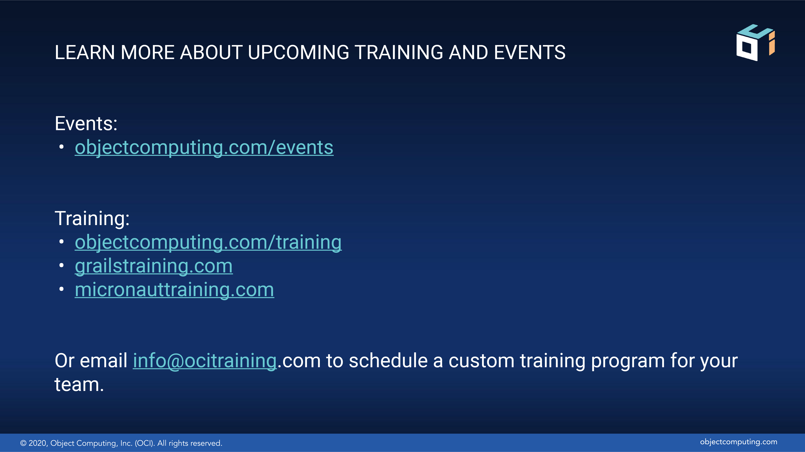

theme: OCI White
slidenumbers: false
[.hide-footer]


```
```
```
```
```
```
# [FIT] **Micronaut Deep Dive**
# [FIT] **10 Things You Can Do with Micronaut**


```
```

---


# About Me

* Graeme Rocher
* Creator of Grails and Micronaut
* Principal Engineer at Object Computing
* 2018 Oracle Groundbreaker Award Winner
* Java Champion

---


# Agenda

* Brief Introduction to Micronaut
* 10 Things You Can Do with Micronaut
* Demos, Demos and more demos
* Summary
* Q & A

----


# Micronaut

* A Microservices and Serverless Focused framework (hence the branding)
* Also a Complete Application Framework for any type of Application
* Dependency Injection, Aspect Oriented Programming (AOP), Configuration Management,
 Bean Introspection and more..


----


# With Micronaut You Can Build

* Microservices
* Serverless Applications
* Message-Driven Applications with Kafka/Rabbit
* CLI Applications
* Even Android Applications
* Anything with 
	`static void main(String..args)`


----


# So What is Micronaut? Really?

* An Application Framework for the Future
* Reflection Free, Runtime Proxy Free, 
  No Dynamic Classloading (in 1.1)
* Ahead of Time (AOT) Compilation AOT APIs
* ... oh and let's you build Microservices


----


# [FIT] **ONE**
## **Just Use Dependency Injection**

----


# Dependency Injection

* Reflection and Runtime Proxy Free
* Supports Configuration Injection
* Supports Aspect Oriented Programming (AOP)
* Constructor, field, method injection all supported


----


# [FIT] **TWO**
## **Build CLI Applications**

----


# CLI Apps

* Integration with PicoCLI
	> https://picocli.info/
* Can use any Micronaunt component,
	like the HTTP client.
* Supports going native with GraalVM 
	for ultra fast execution


----


# [FIT] **THREE**
## **As an HTTP Client**

----


# HTTP Client

* Low level, flexible client
* Also declaring compile time client
* Just declare an interface and have 
   it implemented for you!
* Uses Micronaut's low overead AOP


----


# [FIT] **FOUR**
## **Build Microservices**

----


# [FIT] **FIVE**
## **Build a Native Image with Graal**


----

# Micronaut Startup and Memory


Runtime|Memory|Startup
---|---|---|
JDK 11 | 75MB | 1.1s
JDK 13 | 75MB | 900ms
JDK 13 + CDS | 75MB | 400ms   
GraalVM Substrate | 15MB | 21ms   

----


# [FIT] **SIX**
## **Generate Swagger / Open API**

----


# Swagger / OpenAPI Support

* Compilation time computed
* Adds no overhead to the runtime
* Generated YAML can be imported into Swagger UI
* Or use AutoREST to generate a JS client


----


# [FIT] **SEVEN**
## **Message Driven Microservices with Kafka**

----


# Kafka Support

* Write headless Microservices that just 
	listen for Kafka messages
* Great for real time processing
* Send Kafka messages with `@KafkaClient`, 
  implemented automatically for you.


----


# [FIT] **EIGHT**
## **Query with Micronaut Data JDBC**

----


# Micronaut Data

* Precomputed SQL or JPA-QL queries
* Uses Micronaut's zero overhead AOP
* The JDBC implementation completely reflection free
* Support for Oracle DB, MySQL, Postgres and SQL Server


----


# [FIT] **NINE**
## **Schedule Jobs**

----


# [FIT] **TEN**
## **Gather Metrics and Traces**

----


# Metrics and Tracing

* Tracing: Support for Open Tracing, Zipkin and Jaeger
* Metrics: Based on Micrometer with support for 
ever metric registry imaginable 
* Instrumentation for the whole framework (client and server requests)


----


# Where to Learn More

* Website: https://micronaut.io
* Github: https://github.com/micronaut-projects/micronaut-core
* Comprehensive Guides: https://guides.micronaut.io
* Talk to us on Gitter: https://gitter.im/micronautfw


----

# Summary

* Micronaut provides a wealth of features 
* Tackles a range of uses cases
* General purpose for whatever your needs
* Optimizes for reduced memory usage and startup time
* Works well with Graal native image

----


# [FIT] **Q & A**

----


----


