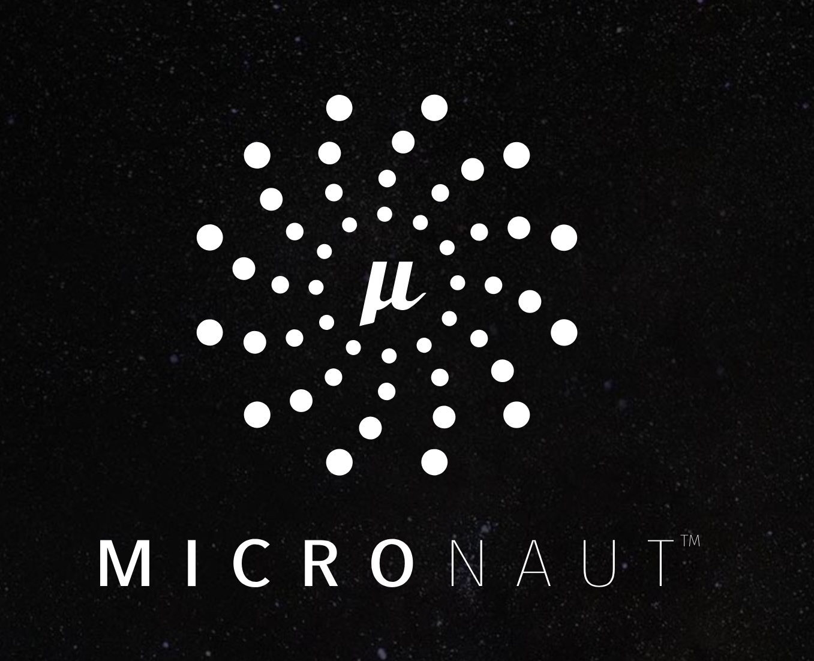
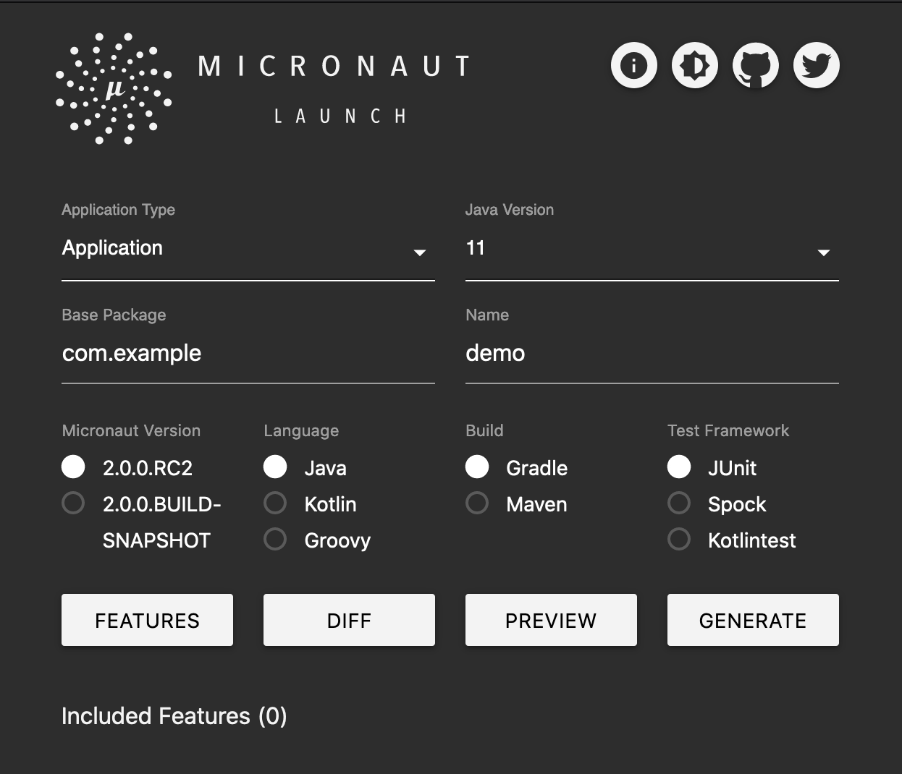

# [FIT] **Introduction to**
# [FIT] **Micronaut 2.0**

---

# About Me

* Graeme Rocher
* Creator of Grails and Micronaut
* Architect at Oracle Labs
* Oracle Groundbreaker Award Winner
* Java Champion
* Leading Oracle's Contributions to Micronaut
* [https://twitter.com/graemerocher](https://twitter.com/graemerocher)
* [https://linkedin.com/graemerocher](https://twitter.com/graemerocher)

---

# Agenda

* Background that led to Micronaut
* Introduction to Micronaut 2.0
* Micronaut Demos!
* Q & A!

----

# Serverless Challenges

* Challenges to optimize Java for Serverless / Microservices scenarios
* Existing Tools and Frameworks Not designed for Cold Starts / Low Memory
* Go, Node etc. better in this regards

----

# Microservice Challenges

* Write once run anywhere no longer as relevent with containers
* The Container is the deployment unit
* Containers and Java require special memory management
* Native images can lead to better resource utilization and lower costs

---

# Traditional Frameworks

[.hide-footer]

Traditional frameworks like Spring, CDI etc. make extensive use of techniques that are bad for memory consumption and startup performance:

* Reflection
* Runtime Byte Code Generation
* Runtime Generated Proxies
* Dynamic Class Loading
* Classpath scanning

---

# The Micro Reality

[.hide-footer]

* Frameworks based on reflection
and annotations become fat
* But we love the programming
model and productivity so
we live with it
* You can turn these features off, but then 
the drop in productivity is massive
* What is the value of Spring without autoconfiguration?

---

[.hide-footer]

----

# Java's Problems for Frameworks

* Limited Annotation API
* Type Erasure
* Slow Reflection
* Reflective Data Caches
* Classpath Scanning
* Slow Dynamic Class Loading

----

# Why is Reflection a Problem?

* Today the JDK is OpenJDK!
* Just take a look...

> https://github.com/openjdk/jdk/blob/e2196f8882b9237926c3ff208bc971c5c31faac7/src/java.base/share/classes/java/lang/Class.java#L3125 

* **All** Reflective data initialized on first access and held in soft references (yes every field, method etc.)
* Won't be GC'ed until your application is low on memory!

---

# Already Solved Problem

* The Android Community already solved the problem
* Ahead of Time Compilation used extensively
* Google Dagger 2.x
	* Compile Time Dependency Injector
	* Reflection Free
	* Limited in Scope to just DI

---

[.hide-footer] 

<!-- # Introducing Micronaut -->

----

# Micronaut is...

* A Microservices and Serverless Focused framework (hence the branding)
* Also a Complete Application Framework for any type of Application
* Dependency Injection, Aspect Oriented Programming (AOP), Configuration Management,
 Bean Introspection and more..

----

# Micronaut Precomputation

* All Dependency & Configuration Injection
* Annotation Metadata (Meta annotations)
* AOP Proxies
* Bean Introspections
* And all other framework infrastructure
* Essentially what Spring/CDI do at runtime

----

# With Micronaut You Can Build

* Microservices
* Serverless Applications
* Message-Driven Applications with Kafka/Rabbit
* CLI Applications
* Even Android Applications
* Anything with
	`static void main(String..args)`

----

# So What is Micronaut? Really?

* An Application Framework for the Future
* Reflection Free, Runtime Proxy Free,
  No Dynamic Classloading
* Ahead of Time (AOT) Compilation AOT APIs
* ... oh and let's you build Microservices

----

# Micronaut's Impact

* Micronaut was announced on March 2018
* Open Sourced 28th of May 2018 
* Sparked industry wide improvements from Red Hat (with Quarkus) and VMware (Spring Boot 2.2+	)
* Micronaut is changing the face of server side Java

----

# Micronaut and GraalVM

* A New Universal Virtual Machine from Oracle
* Features a `native-image` Tool
	* Converts Java -> native machine code using AOT
* Works great with Micronaut!
* Startup time 20ms and Memory Consumption 18MB!

> http://www.graalvm.org

----

# Micronaut and GraalVM

* Micronaut + GraalVM Native Image are a match made in heaven
* So much so I now work at Oracle Labs :)
* Less work to configure Native Image because Micronaut eliminates reflection, runtime proxies, byte code generation and dynamic classloading

> http://www.graalvm.org

----

# Micronaut 2.0

- Massive new release went GA in July
- New Native CLI
- Serverless Support for Azure and GCP
- Incremental compilation for Gradle
- New Maven Plugin

---

# Micronaut 2.0

- Servlet Support (deploy a WAR!)
- HTTP/2 Support
- Massive improvements to GraalVM support
- Much more: [https://docs.micronaut.io/2.0.x/guide/index.html#whatsNew](https://docs.micronaut.io/2.0.x/guide/index.html#whatsNew)

---

# Micronaut Launch

- Generates Micronaut applications
- Fully serverless backend powered by GraalVM Native Image
- Accessable via the browser or `curl`
- Visit [https://launch.micronaut.io](https://launch.micronaut.io) to get started
- Contribute on Github: [https://github.com/micronaut-projects/micronaut-starter](https://github.com/micronaut-projects/micronaut-starter)

----

# [FIT] **DEMO**
## **Micronaut**

---

# Micronaut Project is Healthy

- Actively developed by engineers from Object Computing, Oracle and Google
- 257 contributors 
- Contributions from Google, Amazon, Oracle
- 4.1k stars on GitHub.
- ~9.3k commits.
- Star us! [https://github.com/micronaut-projects/micronaut-core](https://github.com/micronaut-projects/micronaut-core)

---

# Micronaut Foundation

- Established to manage technical direction of the project
- Board members from Oracle, Object Computing, Google etc.
- Helping ensure Micronaut benefits from broad industry support.
- [https://micronaut.io/foundation/](https://micronaut.io/foundation/)

---

# The Future of Java is
# Intelligent Compilers & Smaller, Faster Runtimes

----

# Summary

* Micronaut and GraalVM are leading the AOT revolution
* Server Side Java is Adapting to the Serverless world
* Building more efficient applications possible with right framework choices
* AOT Sacrifices Compilation Speed to Gain so Much More
* Going native now a reality with GraalVM Native Image

---

# Micronaut Resources

- Gitter Community: [https://gitter.im/micronautfw](https://gitter.im/micronautfw)
- User Guide: [http://micronaut.io/documentation.html](http://micronaut.io/documentation.html)
- Micronaut Launch: [https://launch.micronaut.io](https://launch.micronaut.io)
- Micronaut Guides: [http://guides.micronaut.io](http://guides.micronaut.io)
- Twitter: [https://twitter.com/micronautfw](http://micronaut.io/faq.html)
- Github: [https://github.com/micronaut-projects/micronaut-core](https://github.com/micronaut-projects/micronaut-core)

----

# [FIT] **Q & A**
## **Micronaut**
