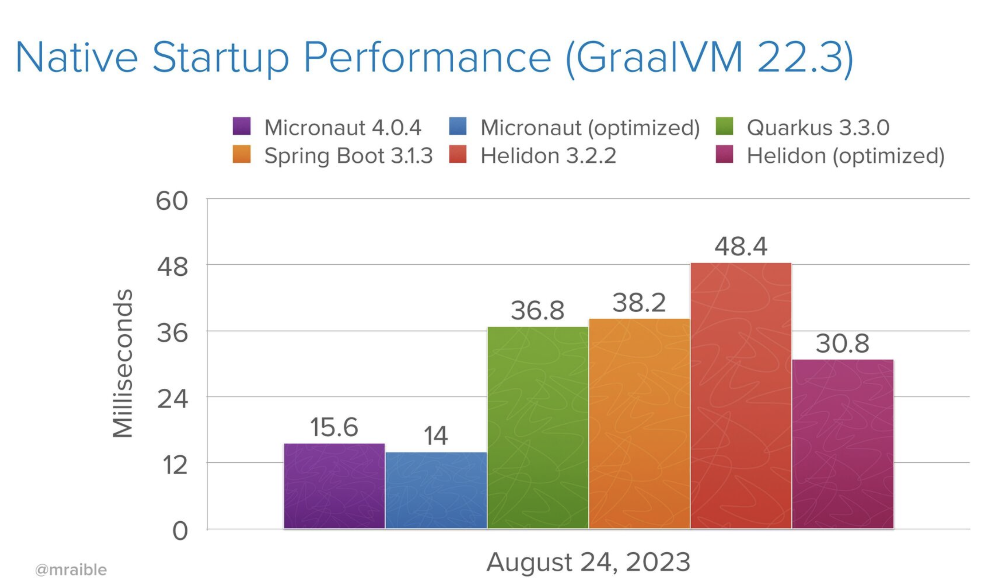

theme: OCI White
slidenumbers: false
[.hide-footer]

<!-- ```
```
```
```
```
```
# [FIT] **Micronaut® 4 & GraalVM**
# [FIT] **Deep Dive**


```
``` -->


---


# About Me

* Graeme Rocher
* Architect at Oracle Labs since 2020
* Creator of Grails and the Micronaut framework
* 2018 Oracle Groundbreaker Award Winner
* https://twitter.com/graemerocher
* https://linkedin.com/in/graemerocher/

---


# Agenda

## Part 1 - Platform Updates - 40 Minutes

* Introduction to the Micronaut framework & GraalVM
* Why the Micronaut framework
* The Micronaut Framework Fundamentals
* Overview of what's new in Micronaut 4?
* Enhancements for GraalVM & JDK 21
* Improved Modularity
* Performance Improvements 

---

# Agenda

## Part 2 - Core Updates - 40 Minutes

* Jakarta Migration
* Dependency Injection Improvements
* Generics & Validation Improvements
* Expression Language
* Bean Mappers (4.1)
* Introspection Improvements for Builders (4.1)
* Kotlin Symbol Processing (KSP)

---

# Agenda

## Part 3 - Web Tier - 40 Minutes

* Virtual Threads (Loom)
* Experimental HTTP/3 & io_uring support
* New Client/Server Filters API
* Micronaut Serialization
* Bidirectional Micronaut OpenAPI Generation
* Micronaut Control Panel
* Context Propagation

---

# Agenda

## Part 4 - Data & Cloud - 40 Minutes

* Micronaut Data Introduction
* Micronaut Data Updates (Hibernate 6, Hibernate Reactive)
* Testcontainers Improvements
* Cloud Module Updates
* Overview of GraalVM Cloud Native


---

## Part 1 - Platform Updates - 40 Minutes

* Introduction to the Micronaut framework & GraalVM
* Why the Micronaut framework
* The Micronaut Framework Fundamentals
* Overview of what's new in Micronaut 4?
* Enhancements for GraalVM & JDK 21
* Improved Modularity
* Performance Improvements 


----


# Java's Challenges for Frameworks

* Limited Annotation API (no model for meta-annotations)
* Type Erasure (heavy burden places in frameworks to resolve types)
* Slow Reflection Initialization for Large Classes
* Reflective Data Caches (stored in soft references)
* Classpath Scanning (no built in indexing of annotated types)
* Complex Dynamic Class Loading


----

# Avoid Reflection!

* Reflection usage increases memory usage
* Scanning reflection data slow
* Many modern server-side frameworks and specifications
 are built on reflection
* Reflection requires extra GraalVM Native Image configuration
* Just say no!


----


# The Micronaut Framework

* The Micronaut framework is an Open Source Java framework that is focused on Modern architectures like Serverless and Microservices
* Also a Complete Application Framework for any type of Application
* A Java annotation processor computes your framework infrastructure at compile time
* HTTP Client/Server based on Netty
* Improved Developer Productivity when building Cloud Native applications


----

# Micronaut Solutions


Problem|Solution
---|---|
Limited Annotation API | Precomputed `AnnotationMetadata`
Type Erasure | Precomputed `Argument` Interface
Slow Reflection | Eliminate Reflection
Reflective Data Caches | Zero Data Caches
Classpath Scanning | No Classpath Scanning
Slow Dynamic Class Loading | No Dynamic Class Loaders

----


# [FIT] The Future Is
# [FIT] Intelligent Compilers
## Smaller, Leaner Runtimes

----

# Introduction to GraalVM

* High-performance JDK distribution

* Increases application throughput, reduces latency, reduces memory use

* Graal just-in-time (JIT) compiler that runs on top of HotSpot, written in Java

* native-image ahead-of-time (AoT) compiler compiles Java applications into small self-contained native binaries


----

# The Micronaut Framework + GraalVM

* The Micronaut Framework + GraalVM Native Image are a match made in heaven

* Less work to configure Native Image because Micronaut eliminates reflection, runtime proxies, byte code generation and dynamic classloading

* Startup time 12ms and Memory Consumption 17MB!


----

# [FIT] **DEMO**
## **Getting Started**

----


# Project Setup

* The Quick Way with Micronaut Launch! (https://start.micronaut.io/):

```bash
$ curl https://start.micronaut.io/demo.zip -o demo.zip
```
* Integrated wizards available for IntelliJ Ultimate and VSCode
* Command line utility also available


----


# Micronaut Test

* Testing library with support for Spock, JUnit 5 and Kotest

> https://github.com/micronaut-projects/micronaut-test

```groovy
testImplementation "io.micronaut.test:micronaut-test-junit5" // Gradle
```

```xml
<dependency> <!-- Maven -->
      <groupId>io.micronaut.test</groupId>
      <artifactId>micronaut-test-junit5</artifactId>
      <scope>test</scope>
</dependency>
```

----


# Micronaut Test

* Allows DI directly into your tests
* Spins up server if present

```java
@MicronautTest
class MathServiceTest {
    @Inject
    MathService mathService;

    @Test
    void testCompute() {
        final Integer result = mathService.compute(4);
        Assertions.assertEquals(16,result);
    }
}
```

----

# What's new in Micronaut 4?

* Baselined in JDK 17, updates for JDK 21
* Massive GraalVM Improvements
* Performance & Memory Improvements
* Modularity
* Expression Language
* Virtual Threads
* Context Propagation
* And loads more...


----

# Micronaut 4 Platform Upgrades

* JDK 17 or Above
* GraalVM for JDK 17 or above
* Groovy 4 or above
* Kotlin 1.8 or above
* Gradle 8
* Maven 3
* AWS SDK v2
* OCI SDK v3
* Kafka 3.5


----

# Performance & Memory


Metric|Micronaut 3|Micronaut 4
---|---|---|
Native Build Time | 1m20s | 1m
Native Startup    | 20ms  | 12ms
Native Image Size | 75mb  | 68MB 
JIT Startup       | 275ms | 240ms
JAR Size          | 14MB  | 11MB

----

* Source Matt Raible: [https://speakerdeck.com/mraible/comparing-native-java-rest-api-frameworks-chicago-jug-2023?slide=67](https://speakerdeck.com/mraible/comparing-native-java-rest-api-frameworks-chicago-jug-2023?slide=67)




----

# GraalVM Enhancements

* Improved build times
* Reduced memory consumption
* Collaboration on shared GraalVM metadata with Spring team
* Vastly more Native testing
* Testcontainers & Native Testing combined


----

# [FIT] **DEMO**
## **Micronaut & GraalVM**

----

# Micronaut AOT

* Post compilation whole world optimizations on byte code
* Included by default in Micronaut 4.x
* Allows further optimizations (convert XML to Java for logback, reducing beans to be loaded for current configuration etc.)
* [https://micronaut-projects.github.io/micronaut-aot/latest/guide/](https://micronaut-projects.github.io/micronaut-aot/latest/guide/)


----

# Native Testing with GraalVM

* Write native tests with JUnit 5
* Run tests with `./gradlew nativeTest` or `./mvnw test -Pnative`
* If necessary collect GraalVM metadata with tracing agent
* Contribute to the effort to create community-wide metadata!
* TODO: Add link the metadata repo


----

# GraalVM Shared Metadata Repository

* GraalVM Native Image plugins for Gradle & Maven have built in support
* Metadata collaboratively maintained and tested
* Broad community contributions from Micronaut, GraalVM and Spring teams
* Contribute today! [https://github.com/oracle/graalvm-reachability-metadata](https://github.com/oracle/graalvm-reachability-metadata)


---

# JDK Updates

* New minimum for Micronaut 4 is JDK 17
* API enhancements benefit from records and sealed classes/interfaces
* Support for JDK 21 Virtual Threads (Loom)
* Codebase cleanup as workarounds for older JDK versions removed

---

# Improved Modularity

* Reduction in required third-party dependencies - Jackson, SnakeYAML, Caffeine no longer required
* Compiler API and Runtime API split - Removes ASM as a runtime dependency and reduces runtime classes by 2MB
* Core modules now optional - Micronaut Retry, Micronaut Discovery, Micronaut Validation

---


## Part 2 - Core Updates - 40 Minutes

* Jakarta Migration (`javax` ➡ `jakarta`)
* Dependency Injection Improvements
* Generics & Validation Improvements
* Expression Language
* Bean Mappers (4.1)
* Introspection Improvements for Builders (4.1)
* Kotlin Symbol Processing (KSP)

---

# The great `jakarta` migration

Completed migration of APIs from `javax` to `jakarta` namespace:

Old API|New API
---|---|
`javax.annotation` | `jakarta.annotation`
`javax.transaction` | `jakarta.transaction`
`javax.validation` | `jakarta.validation`
`javax.email` | `jakarta.email`
`javax.persistence` | `jakarta.persistence`

___

# OpenRewrite to the Rescue!

* Gradle and Maven plugins to automate upgrade necessary to Micronaut 4
* [https://docs.openrewrite.org/recipes/java/micronaut/updatebuildtomicronaut4version](https://docs.openrewrite.org/recipes/java/micronaut/updatebuildtomicronaut4version)


----

# [FIT] **DEMO**
## **Micronaut 4 Dependency Injection Enhancements**

----

# Micronaut DI Improvements

* Map Injection:

```
@Inject Map<String, MyBean> myBeans;
```

* Improved Error Reporting
* Optimized Performance

---


# Introduction to Micronaut Validation

* Support for `jakarta.validation` annotations and built on Micronaut AOP

```java
import javax.validation.constraints.NotBlank;

@Singleton
public class PersonService {
    public void sayHello(@NotBlank String name) {
        System.out.println("Hello " + name);
    }
}
```

----


# [FIT] **DEMO**
## **Micronaut Validation Updates**

---


# Micronaut Validation with Micronaut 4

* Updated to `jakarta.validation` namespace
* Support for validation annotations on generics
* Based on new core framework support for resolving annotations on generics at compilation time (no type erasure worries!)

```java
List<@NotBlank String> names;
```

---

# Validation Modules Optional 

* Validation modules are optional, add dependencies to enable.

```java
annotationProcessor("io.micronaut.validation:micronaut-validation-processor")
implementation("io.micronaut.validation:micronaut-validation")
```

```xml
<dependency> <!-- Maven -->
      <groupId>io.micronaut.validation</groupId>
      <artifactId>micronaut-validation</artifactId>
</dependency>
...
<path> <!-- annotationProcessorPaths -->
      <groupId>io.micronaut.validation</groupId>
      <artifactId>micronaut-validation-processor</artifactId>
</path>      
```
----


# Expression Language

* New Type Checked, Compile-Time and Secure Expression Language (EL)

```java
@Singleton
public class ExampleJob {
    private boolean paused = true;

    @Scheduled(
        fixedRate = "1s",
        condition = "#{!this.paused}") 
    void run() {
        System.out.println("Job Running");
    }

    public boolean isPaused() {
        return paused;
    } 

    public void setPaused(boolean paused) {
        this.paused = paused;
    }
}	 							   
```

----

# [FIT] **DEMO**
## **Expression Language**


----

# BeanMappers (4.1)

* Built in, type safe alternative to MapStruct for type mapping built on EL.

```java
@Singleton
public interface ProductMappers {
    // perform mathematical operations, and provde formatting
    @Mapping(to = "price", from = "#{product.price * 2}", format = "$#.00")
    // traverse the object graph
    @Mapping(to = "distributor", from = "#{product.distributor.name}")
    // combined with custom properties
    @Mapping(to = "storeName", from = "#{this.storeName}")
    ProductDTO toProductDTO(Product product);

    default String getStoreName() {
        return "My Awesome Storefront!";
    }
}
```

----

# Bean Introspections

```java
@Introspected
class MyBean {
    private String name; //getter/setter omitted
}

// or

@Introspected
record MyBean(String name) {}
```
* AOT Reflection-Free replacement for `java.beans.Introspector`
* Set/get bean properties, create instances
* Includes `AnnotationMetadata`
* Works with Java 17+ records

----

# `@Introspected`

```java
BeanIntrospection<MyBean> bi =
	BeanIntrospection.getIntrospection(MyBean.class);
MyBean bean = bi.instantiate();
bi.getRequiredProperty("name")
   .set(bean, "Some Value");
```
* Read/Write bean properties without reflection
* The foundation for Micronaut Serialization, Micronaut Data etc.

----

# [FIT] **DEMO**
## **Micronaut 4 & Bean Introspections**

----

# Micronaut 4: Introspections with Builders

```java
@Introspected(builder=@IntrospectionBuilder(builderClass=MyBean.Builder.class))
record MyBean(String name) {}

BeanIntrospection.Builder<MyBean> builder =
	BeanIntrospection.getIntrospection(MyBean.class).builder();
MyBean bean = builder
    .with("name", "Some Value")
    .build();

```
* Works regardless if there is underyling builder or not 
* Underpins Micronaut Serialization for builders + JSON

----

# Kotlin Symbol Processing (KSP)

* New support for using KSP instead of Kotlin Annotation Processing (KAPT)
* Eliminates the need to generate Java stubs for Kotlin code
* Allows processing the native Kotlin AST, avoiding loss of information (named arguments, delegates etc.)
* Faster incremental compilation
* Only supported with Gradle 


---

## BREAK TIME (Back in 15 minutes)

After the break come back to hear about:

* Virtual Threads (Loom)
* Experimental HTTP/3 & io_uring support
* New Client/Server Filters API
* Micronaut Serialization
* Bidirectional Micronaut OpenAPI Generation
* Micronaut Control Panel
* Context Propagation


----


## Part 3 - Web Tier - 40 Minutes

* Virtual Threads (Loom)
* Experimental HTTP/3 & io_uring support
* New Client/Server Filters API
* Micronaut Serialization
* Bidirectional Micronaut OpenAPI Generation
* Micronaut Control Panel
* Context Propagation


----

# Virtual Threads

* When JDK 21+ configured blocking thread pool now runs Virtual Threads
* Micronaut's fundamental non-blocking architecture benefits from Virtual threads as HTTP client when blocked doesn't pin the carrier thread
* Virtual threads great for I/O bound workloads (not appropriate for CPU-bound!)

```properties
micronaut.server.thread-selection=blocking
```

---

# New Loom-Aware Client / Server Filter API

```java
@ServerFilter("/hello/**") // annotation-based
public class TraceFilter {
    
    @RequestFilter // intercept requests
    // run methods on virtual threads
    @ExecuteOn(TaskExecutors.BLOCKING) 
    public void filterRequest(HttpRequest<?> request) {
        traceService.trace(request); 
    }

    @ResponseFilter // intercept responses
    public void filterResponse(MutableHttpResponse<?> res) {
        res.getHeaders().add("X-Trace-Enabled", "true");
    }
}
```

---

# HTTP/3 Support

* Experimental Client & Server support for incubating Netty HTTP/3 API (QUIC)

```java
// build configuration
implementation("io.netty.incubator:netty-incubator-codec-http3")
```

```properties
# application.properties
micronaut.server.netty.listeners.http3Listener.family=QUIC
micronaut.server.netty.listeners.http3Listener.port=8443
micronaut.http.client.alpn-modes=h3
```

---

# Micronaut Serialization

* Build Time replacement for Jackson that eliminates reflection
* Supports most Jackson annotations
* Reduces memory footprint
* More secure as doesn't allow abitrary serialization of objects
* Automatically compatible with Native Image

    - https://micronaut-projects.github.io/micronaut-serialization/latest/guide/


----


# [FIT] **DEMO**
## **Micronaut Serialization**


----

# Micronaut Serialization

```java
import io.micronaut.serde.annotation.Serdeable;
@Serdeable
public record Person(
    String name,
    int age) {
}
```

* Annotate types you want to allow to be serialized or deserialized
* Use annotation API you prefer (Jackson Annotations or JSON-B)
* Use runtime you prefer (Jackson Parser or JSON-P)

----


# [FIT] **DEMO**
## **Micronaut OpenAPI**

----

# Micronaut OpenAPI

* Generate OpenAPI 3.x spec from Java sources
* Generate Java sources from OpenAPI 3.x spec
* [https://github.com/micronaut-projects/micronaut-openapi/](https://github.com/micronaut-projects/micronaut-openapi/)


----

# Micronaut OpenAPI Client Generation

```java
// build.gradle
micronaut {
  openapi {
    client(file("src/openapi/openmeteo.yml")) {
      apiPackageName = "example.openmeteo.api"
      modelPackageName = "example.openmeteo.model"
    }
  }
}
```
```xml
<properties> <!-- pom.xml -->
  <micronaut.openapi.generate.client>true</micronaut.openapi.generate.client>
  <micronaut.openapi.definition>src/openapi/openmeteo.yml</micronaut.openapi.definition>
  <micronaut.openapi.api.package.name>example.openmeteo.api</micronaut.openapi.api.package.name>
  <micronaut.openapi.model.package.name>example.openmeteo.model</micronaut.openapi.model.package.name>
</properties>
```

----

# Micronaut OpenAPI Server Generation

```java
// build.gradle
micronaut {
  ...
  openapi {
    server(file("src/main/resources/library-definition.yml")) { 
      apiPackageName = "example.micronaut.api"
      modelPackageName = "example.micronaut.model"
    }
  }
}
```
```xml
<properties>
    <micronaut.openapi.generate.server>true</micronaut.openapi.generate.client> 
    <micronaut.openapi.definition>src/main/resources/library-definition.yml</micronaut.openapi.definition> 
    <micronaut.openapi.api.package.name>micronaut.example.api</micronaut.openapi.api.package.name> 
    <micronaut.openapi.model.package.name>micronaut.example.model</micronaut.openapi.model.package.name> 
</properties>
```

----


# [FIT] **DEMO**
## **Micronaut Control Panel**

----

# Micronaut Control Panel

* UI and extension model for visualizing observability and monitoring data
* [https://github.com/micronaut-projects/micronaut-control-panel](https://github.com/micronaut-projects/micronaut-control-panel)


----

# Micronaut Context Propagation

* Context Propagation completely rewritten with new API and deeply integrated
* Micronaut Data Transaction Management rewritten ontop of new API allowing both synchronous and reactive transaction management
* New support for Open Telemetry included in Micronaut 4.x
* Support for Micrometer Context Propgation supported
* Micrometer Observability coming in 4.2

---

# Context Propagation

```java
@ServerFilter(MATCH_ALL_PATTERN)
public class MdcFilter {

    @RequestFilter
    public void myRequestFilter(
        HttpRequest<?> request, 
        MutablePropagatedContext mutablePropagatedContext) {
        try {
            String trackingId = request.getHeaders().get("X-TrackingId");
            MDC.put("trackingId", trackingId);
            mutablePropagatedContext.add(new MdcPropagationContext());
        } finally {
            MDC.remove("trackingId");
        }
    }

}
```

----

## Part 4 - Data & Cloud - 40 Minutes

* Micronaut Data Introduction
* Micronaut Data Updates (Hibernate 6, Hibernate Reactive)
* Testcontainers Improvements
* Cloud Module Updates
* Overview of GraalVM Cloud Native

----


# Existing Data Access Solutions

* Spring Data, GORM etc.
* Rely heavily on reflection and runtime proxies
* Must compute queries at runtime
* Not type checked at compilation time


----


# Micronaut Data

* Precomputes Queries at compilation time
* Uses Micronaut's reflection-free AOP
* Zero runtime overhead database access solution
* Compilation time checking
* Smaller stack traces


---

# Micronaut Data

* Many different implementations available dependencing on requirements
* Micronaut Data JPA  (Hibernate & Hibernate Reactive)
* Micronaut Data JDBC (Synchronous)
* Micronaut Data R2DBC (Reactive)
* Micronaut Data MongoDB (built on Micronaut Serialization)
* Micronaut Data Oracle Coherence

    - https://micronaut-projects.github.io/micronaut-data/latest/guide/


---

# Micronaut Test Resources

* Testcontainers integration for automatic container provisioning
  [https://micronaut-projects.github.io/micronaut-test-resources/latest/guide/](https://micronaut-projects.github.io/micronaut-test-resources/latest/guide/)
* Gradle and Maven plugins that spin up a separate server to host containers
* Allows easy integration testing and reuse of containers with shared server


----

# Micronaut Test Resources

* Supports running GraalVM native tests against the shared server
* Support for all major databases
* Automatic restarts in development mode without restarting the containers


----


# [FIT] **DEMO**
## **Micronaut Data**


---

# Micronaut Data in Micronaut 4

* Rewritten transaction management with support for reactive tx management
* Support for Hibernate Reactive
* Support for Oracle Database JSON Duality Views
* [https://blogs.oracle.com/java/post/json-relational-duality-views-with-micronaut-framework](https://blogs.oracle.com/java/post/json-relational-duality-views-with-micronaut-framework)


----
# More Guides on Micronaut Data

* Access a Database with Micronaut Data JDBC - https://guides.micronaut.io/latest/micronaut-data-jdbc-repository.html
* Access a Database with Micronaut Data JPA - https://guides.micronaut.io/latest/micronaut-jpa-hibernate.html
* Access a Database with Micronaut Data MongoDB - https://guides.micronaut.io/latest/micronaut-mongodb-synchronous.html

---

# Cloud Module Updates

* AWS API Gateway Payload v1 and v2 support
* AWS Lambda CDK in Launch
* Oracle Cloud Certificate Service support
* Netty / Micronaut Serialization transport layer for OCI SDK v3


---

# Introduction to GraalVM Cloud Native (GCN)

* Curated set of Micronaut modules built at Oracle with support provided
* Opinionated project generator for building Multi-cloud applications
* Guided tutorials and labs on how to build GraalVM native Cloud-portable applications
* Support for AWS & Oracle Cloud with Azure & GCP coming


----


# [FIT] **DEMO**
## **GraalVM Cloud Native**

---

# GraalVM Cloud Native (GCN) for Micronaut

Oracle Labs' development of GCN has benefited Micronaut with a Cloud-first focus driving upstream contributions for Cloud portable abstractions for:

    - Object Storage
    - Logging
    - Metrics
    - Secrets
    - Tracing

[https://www.graal.cloud/gcn/](https://www.graal.cloud/gcn/)    


---


# Where to Learn More

* Micronaut Docs (Reference Material and APIs) - [https://docs.micronaut.io](https://docs.micronaut.io)
* Micronaut Guides (Guided Tutorials with Sample Code) - [https://guides.micronaut.io](https://guides.micronaut.io)
* GraalVM Cloud Native Guides and Virtual Labs - [https://www.graal.cloud/gcn/](https://www.graal.cloud/gcn/)
* GraalVM Docs - [https://www.graalvm.org/latest/docs/](https://www.graalvm.org/latest/docs/)
* Follow on Social https://twitter.com/micronautfw and https://twitter.com/graalvm


---

# What's Coming?

* Micronaut Framework 4.2
    - Source Code Generation APIs for compiler
    - Micrometer Observability support
    - Asciidoc documentation generation from OpenAPI
    - Further performance optimizations
    - Gradle 8.4 & JDK 21 added to Micronaut Launch


----


# [FIT] The Future Is
# [FIT] Intelligent Compilers
## Smaller, Leaner Runtimes

----

# Summary

* The Micronaut Framework Provides an Awesome Set of Framework Building Blocks
* By reducing reflection the runtime is simpler allowing easier closed work static analysis
* Provides high productivity without the performance penalty
* Micronaut 4 brings a wealth of improvements to the developer experience
* GraalVM Native integration getting better and better

----


----


# [FIT] **Q & A**
