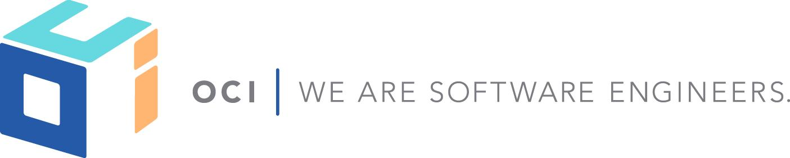
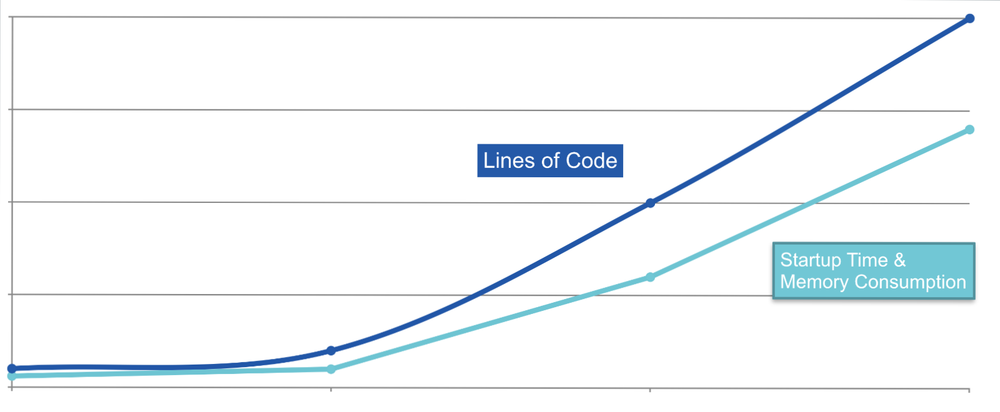
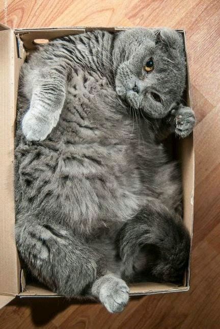
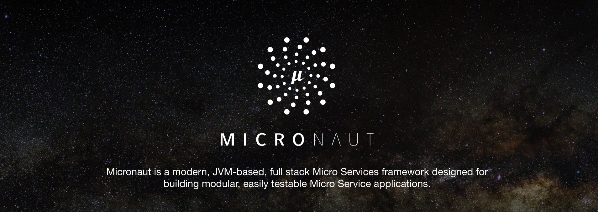
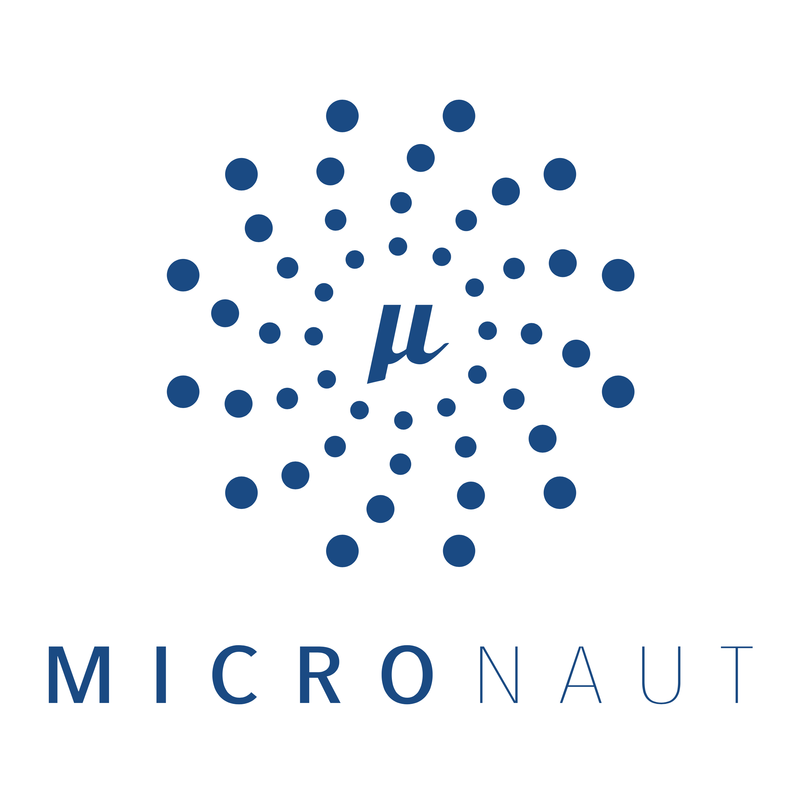

footer: © Object Computing Inc., 2018
slidenumbers: true



## Launching the Micro Future

> Groovy, Grails and Project Particle
-- by Graeme Rocher

---

## Then and Now

* Since 2008, a lot has changed
* 10 years ago Grails 1.0 was released!
* Everybody was building Monoliths
* No Angular, No React, No Docker, No Micro Services


---

## So We Try to Adapt

* Let's try and fit Monolith focused framework into Micro environment!
* Spring and Grails were never designed for this
* ... No matter how much marketing you hear


---

## What to do, What to do?

Shall we:

1.  Try and convince people that something never designed for Micro Services is still ok?
2. Go back to the drawing board


---

## The Goal

* Create a New Framework designed from the ground-up for Micro Services and Server-less Computing
* Blazing fast startup time
* Low Memory Footprint
* As Small As Possible JAR Sizes
* Zero Dependency
* 12 Factor - https://12factor.net


---

## The Analysis

To meet this goal we performed an analysis of Spring and Grails and the challenges to using them to develop Micro Service applications


---

# What Spring (and Grails) Do

Spring is an amazing technical achievement and does so many things, but does them _at Runtime_.

* [Reads the byte code](https://github.com/spring-projects/spring-framework/tree/master/spring-core/src/main/java/org/springframework/core/type/classreading) of every bean it finds
* [Synthesizes new annotations](https://github.com/spring-projects/spring-framework/blob/master/spring-core/src/main/java/org/springframework/core/annotation/AnnotationUtils.java#L1428) for each annotation on each bean method, constructor, field etc. to support Annotation metadata
* [Builds Reflective Metadata](https://github.com/spring-projects/spring-framework/blob/master/spring-beans/src/main/java/org/springframework/beans/CachedIntrospectionResults.java) for each bean for every method, constructor, field etc.

---

# So What's the Problem?



---

# The Micro Reality

* With Spring (and Grails) anything beyond "Hello World" becomes fat quickly
* But we love the programming model and productivity so we live with it
* There must be a better way... right?



---
<!-- # Introducing Micronaut -->



---

# Introducing Micronaut

* Designed from the ground up with Micro Services in mind
* Ultra-light weight and Reactive - Based on Netty
* Integrated Compile-Time Dependency Injection and AOP
* HTTP Client & Server



---

# Hello Micronaut

```groovy
@Controller
class HelloController {
    @Get("/hello/{name}")
    String hello(String name) { "Hello $name!" }
}
// Client Generated at Compile Time
@Client("/")
interface HelloClient {
  @Get("/hello/{name}")
  String hello(String name)
}
```

---

# How Small?

* Micronaut Hello World JAR is 8MB when written Java or 12MB in Groovy
* Can be run with as little as 8mb Max Heap (12 for Groovy)
* Startup time is sub-second
* All Dependency Injection, AOP and Proxy generation happens at compile time


---

# But... How?

* Compile Time Dependency Injection & AOP for Groovy and Java
* Annotation metadata produced at Compile Time
* Reflection Free and No Reflection Data Caching


---


# Not Another HTTP Server!?

* If all we had achieved was another HTTP server Micronaut wouldn't be very interesting
* So what else does it do?


---

# Natively Cloud Native

* Service Discovery - Consul and Eureka Supported; Route 53 Planned
* Configuration Sharing - Consul Supported; Amazon & GCP Planned
* Client Side Load Balancing - Integrated or Netflix Ribbon Supported
* Support for Serverless Computing via AWS Lambda


---

# DEMO TIME


---

# The HTTP Server

* Fully Reactive and non-blocking - Reactor and RxJava 2.x support
* Auto configuration for common databases

```groovy
@Get('/pets')
Single<List<Pet>> pets() {
    petClient.list()
            .onErrorReturnItem(Collections.emptyList())
}
```
---

# The HTTP Client

* Client Implementations Produced at Compile Time
* Service Discovery by Service ID
* Automatic Client Side Load Balancing & Fallback

```java, [.highlight: 1, 3-4]
@Client(id = "pets", path = "/v1")
interface PetClient {
    @Get('/pets')
    Single<List<Pet>> list()
}
```

---

# Serverless Computing

* Write Functions and Run them locally or as regular server applications
* Deploy Functions to AWS Lambda - after warm-up functions execute in milliseconds

```java
@Field @Inject Twitter twitter

@CompileStatic
URL updateStatus(Message status) {
    Status s = twitter.updateStatus(status.text)
    String url = "https://twitter.com/$s.user.screenName/status/${s.id}"
    return new URL(url);
}
```

---

# Micronaut Roadmap

* First Milestones in Q2
* GA by the end of the year
* TODO: AWS Route 53, Google Metadata Server Support
* TODO: Metrics & Distributed Tracing
* TODO: Retry & Hystrix Support


---

# What About Grails?

* Grails is _awesome_, *mature* and *robust*
* ... for Creating Monoliths
* Not Every Application Needs Micro Services
* You Will Want Parts if Micronaut in your Grails apps (HTTP Client, Discovery Client etc.)


---

# Grails 4.0 (Q4 2018)

* Java 8 minimum, Java 9 support, Groovy 2.5
* Spring Boot 2 and Spring 5
* GORM 7.0 
* Micronaut Integration


---

# Summary

* Micronaut aims to provide the same wow factor for Micro Services that Grails did for Monoliths
* Built by the people that made Grails, leveraging over 10 years experience in framework development
* Coming soon in 2018


---

# Q & A TIME


