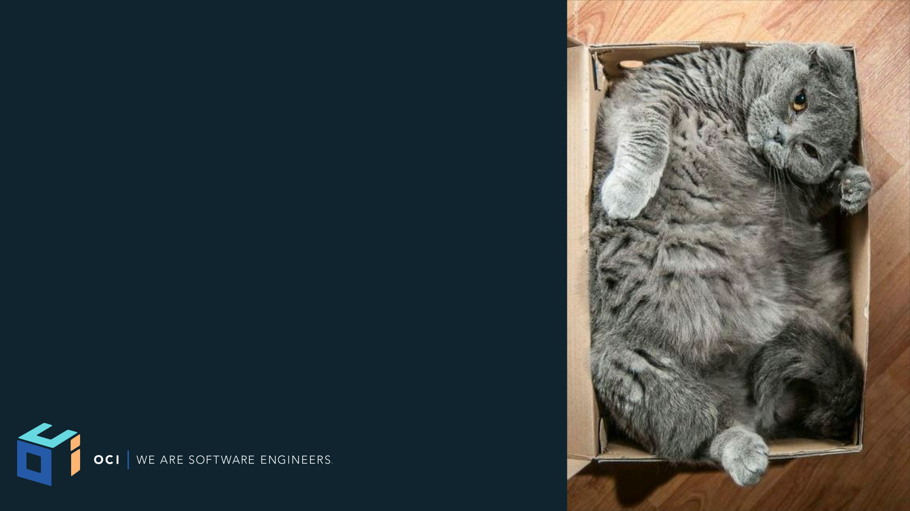
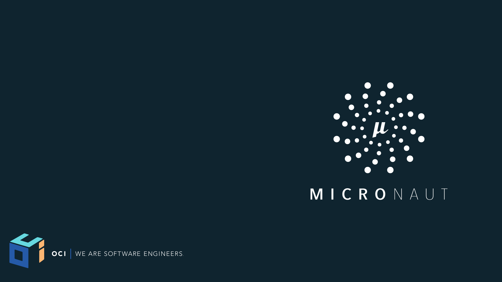

footer: © Object Computing Inc., 2018
slidenumbers: false


[.hide-footer]

# [FIT] Introduction to Micronaut
> Ultra-Lightweight Microservices for the JVM
-- by Graeme Rocher


---


[.hide-footer]

# About Me - Graeme Rocher

* Creator of Grails (http://grails.org)
* Creator of Micronaut (http://micronaut.io)
* Author "The Definitive Guide to Grails"
* Former SpringSource -> VMware -> Pivotal 
* Senior Engineer at Object Computing (http://objectcomputing.com)
* Just Received 2018 Oracle Groundbreaker award - Thanks!

---


[.hide-footer]

# Agenda

* How we got here
* Microservice Challenges
* Microservice Framework Lanscape
* Micronaut Demos


---


[.hide-footer]

# Then and Now

- Since 2008, a lot has changed
- 10 Years is a long time in technology
- Everybody was building 
Monoliths
- No Angular, No React, 
No Docker, No Microservices

---

# So We Try to Adapt


[.hide-footer]

* Let's try adapt existing legacy technologies for Microservices
* Technologies like Spring, Jakarta EE etc were never optimized for low memory footprint Microservices


---

# What to do, What to do?

Shall we:

1.  Try and convince people that something never designed for Microservices is still ok?
2. Go back to the drawing board


---


[.hide-footer]

# The Goal
* Create a New Framework designed from the ground-up for Microservices and Serverless Computing
* Blazing fast startup time
* Low Memory Footprint
* As Small As Possible JAR Sizes
* Zero Dependency
* 12 Factor - https://12factor.net


---

# The Analysis

To meet this goal we performed an analysis of Spring and Grails and the challenges to using them to develop Microservice applications


---

# What Spring and Jakarta EE Do


[.hide-footer]

Spring is an amazing technical achievement and does so many things, but does them _at Runtime_.

* [Reads the byte code](https://github.com/spring-projects/spring-framework/tree/master/spring-core/src/main/java/org/springframework/core/type/classreading) of every bean it finds
* [Synthesizes new annotations](https://github.com/spring-projects/spring-framework/blob/master/spring-core/src/main/java/org/springframework/core/annotation/AnnotationUtils.java#L1428) for each annotation on each bean method, constructor, field etc. to support Annotation metadata
* [Builds Reflective Metadata](https://github.com/spring-projects/spring-framework/blob/master/spring-beans/src/main/java/org/springframework/beans/CachedIntrospectionResults.java) for each bean for every method, constructor, field etc.

---


[.hide-footer]

# So What's the Problem?


---


[.hide-footer]


---

# The Micro Reality



[.hide-footer]

* Frameworks based on reflection 
and annotations become fat
* But we love the programming 
model and productivity so 
we live with it
* So ... why should we be 
more efficient?

---

# Imagine if Kubernetes or Docker had been written in Spring or Jakarta EE instead of Go?

---

# Already Solved by Ahead of Time (AOT) Compilation

* The Android Community already solved the problem
* Ahead of Time Compilation used extensively
* Google Dagger 2.x
	* Compile Time Dependency Injector
	* Reflection Free
	* Limited in Scope to just DI

---


[.hide-footer] 

<!-- # Introducing Micronaut -->

---



[.hide-footer]

# Introducing Micronaut
* Designed from the ground up 
with Microservices in mind
* Ultra-light weight and 
Reactive - Based on Netty
* Uses Ahead of Time Compilation 
* HTTP Client & Server
* Support for Java, Kotlin 
  and Groovy

---


[.hide-footer]

# [fit] DEMO

* Hello Micronaut 

---

# Hello Micronaut


[.hide-footer]

```groovy
@Controller
class HelloController {
    @Get("/hello/{name}")
    String hello(String name) { return "Hello " + name; }
}
@Client("/") // Client Generated at Compile Time
interface HelloClient {
  @Get("/hello/{name}")
  String hello(String name);
}
```

---


[.hide-footer]

# How Small?

* Smallest Micronaut Hello World JAR is 10MB when written Java or 12MB in Groovy
* Can be run with as little as 10mb Max Heap with Kotlin or Java (22mb for Groovy)
* Startup time around a second for Kotlin or Java (a little more for Groovy)
* All Dependency Injection, AOP and Proxy generation happens at compile time

---


[.hide-footer]

# What Micronaut Computes at Compile Time

* All Dependency & Configuration Injection
* Annotation Metadata (Meta annotations)
* AOP Proxies
* Essentially all framework infrastructure
* ie. What Spring/CDI do at runtime

---


[.hide-footer]

# Not Another Framework!?

* If all we had achieved was 
another HTTP server 
Micronaut wouldn't be very 
interesting
* So what else does it do?

---

# Natively Cloud Native


[.hide-footer]

* Service Discovery - Consul, Eureka, Route 53 and Kubernetes 
* Configuration Sharing - Consul Supported and Amazon ParameterStore 
* Client Side Load Balancing - Integrated or Netflix Ribbon Supported
* Support for Serverless Computing; AWS Lambda, OpenFaas, Fn Supported; Azure coming

---


[.hide-footer]

# [fit] DEMO 

* Micronaut Pet Store

---

# Serverless Computing


[.hide-footer]

* Write Functions and Run them locally or as regular server applications
* Deploy Functions to AWS Lambda - after warm-up functions execute in milliseconds

```java
@Field @Inject Twitter twitter

@CompileStatic
URL updateStatus(Message status) {
    Status s = twitter.updateStatus(status.text)
    String url = "https://twitter.com/$s.user.screenName/status/${s.id}"
    return new URL(url)
}
```

---


# GraalVM

* New Polyglot VM from Oracle
* Runs JS, Java, Ruby, R etc.
* Ability to turn Java code native
* https://www.graalvm.org 

---


# GraalVM Native

* Works well when:
	* Little or no runtime reflection is used
	* Limited or no dynamic classloading
	* You plan ahead
	* You use third party libraries selectively

---


[.hide-footer]

# [fit] DEMO 


* Micronaut + GraalVM

---


[.hide-footer]

# Micronaut 1.0 Out Now

- Compile Time DI & AOP
- HTTP Client & Server
- Service Discovery
- Distributed Tracing
- Serverless Functions
- Data Access: SQL, MongoDB, 
  Redis, Cassandra etc.

---


[.hide-footer]

# Micronaut 1.0 on SDKman!

* The Micronaut CLI now available 
  via SDKman!

```bash
$ curl -s "https://get.sdkman.io" | bash
$ source "$HOME/.sdkman/bin/sdkman-init.sh"
$ sdk install micronaut
$ mn create-app hello-world
```
---

# Micronaut Resources

- Gitter Community: [https://gitter.im/micronautfw](https://gitter.im/micronautfw)
- User Guide: [http://micronaut.io/documentation.html](http://micronaut.io/documentation.html)
- Micronaut Guides: [http://guides.micronaut.io](http://guides.micronaut.io)
- FAQ: [http://micronaut.io/faq.html](http://micronaut.io/faq.html)
- Github: [https://github.com/micronaut-projects/micronaut-core](https://github.com/micronaut-projects/micronaut-core)
- Examples: [https://github.com/micronaut-projects/micronaut-examples](https://github.com/micronaut-projects/micronaut-examples)

---
# Micronaut Events 

- Loads of upcoming Events
- Checkout - http://micronaut.io/events.html
- Fancy a trip to Paris?
	- https://voxxeddays.com
	


<!-- [.hide-footer] -->

---	

# Summary

* Micronaut aims to provide the same wow factor for Microservices that Grails did for Monoliths
* Built by the people that made Grails, leveraging over 10 years experience in framework development
* Uses Ahead of Time Compilation to support low-memory footprint 
* Micronaut 1.0 is available now


---


[.hide-footer]

# [FIT] Q & A