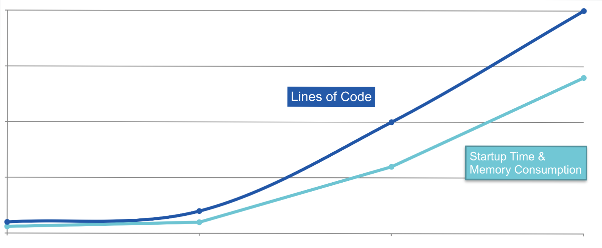
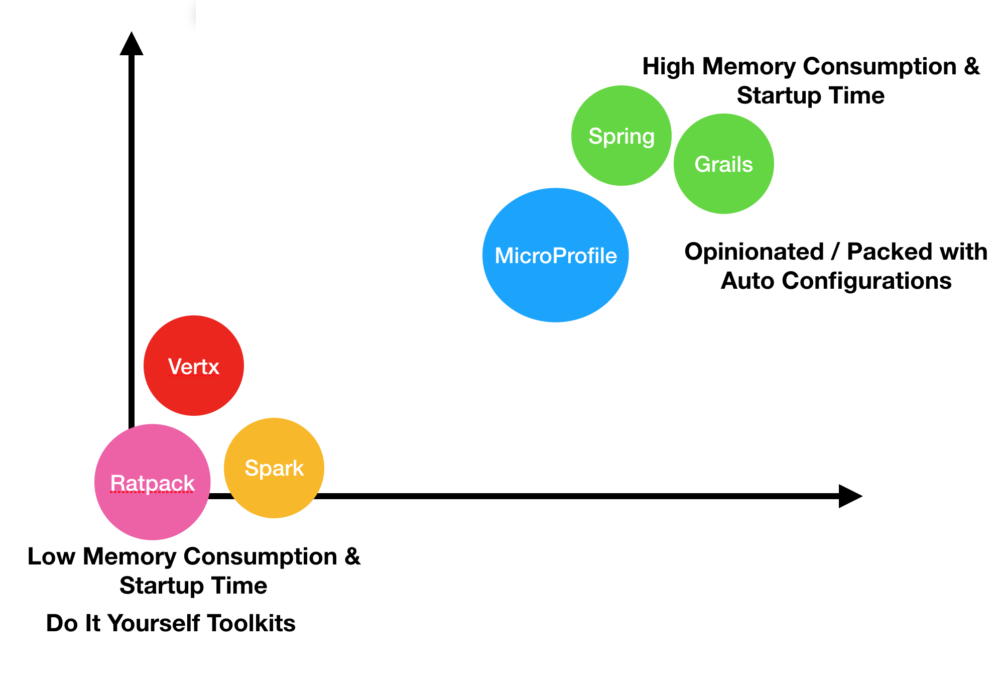

theme: OCI White
slidenumbers: false
[.hide-footer]


```
```
```
```
```
```
# [FIT] **Introduction to Micronaut**

```
```

---


# About Me

* Graeme Rocher
* Creator of Grails and Micronaut
* Principal Engineer at Object Computing
* Oracle Groundbreaker Award Winner
* Based in Pais Vasco

---


# Agenda

* Challenges Facing Java and Software in General
* Microservces and Serverless vs. Traditional Models
* Micronaut Demos!
* Q & A!

----


# Serverless Challenges

* Challenges to using Java in Serverless / Microservices scenarios
* Existing Tools and Frameworks Not Optimized for Cold Starts / Low Memory
* Go, Node etc. better in this regards
* Tim Bray (Amazon/AWS) and others not recommending Java 

>> https://youtu.be/IPOvrK3S3gQ?t=1109


----


# Adapting to Serverless 

* Optimize for cold starts
* Forget about connection pools
* Don't bother with local caches
* Choose technology based on your cold start requirements

----


# Adapting to Microservices 

* Cold starts less important, but still important
* The Container is the deployment unit
* Containers and Java require special memory management
* Optimization for memory usage required


---

# Traditional Frameworks


[.hide-footer]

Spring is an amazing technical achievement and does so many things, but does them at runtime.

* [Reads the byte code](https://github.com/spring-projects/spring-framework/tree/master/spring-core/src/main/java/org/springframework/core/type/classreading) of every bean it finds
* [Synthesizes new annotations](https://github.com/spring-projects/spring-framework/blob/master/spring-core/src/main/java/org/springframework/core/annotation/AnnotationUtils.java#L1428) for each annotation on each bean method, constructor, field etc. to support Annotation metadata
* [Builds Reflective Metadata](https://github.com/spring-projects/spring-framework/blob/master/spring-beans/src/main/java/org/springframework/beans/CachedIntrospectionResults.java) for each bean for every method, constructor, field etc.

---

# What to do, What to do?

1. Tough technology decisions ahead
2. Choose appropriately tool for the job
3. Traditional frameworks often not the best choice


---

# The Micro Reality


[.hide-footer]

* Frameworks based on reflection 
and annotations become fat
* But we love the programming 
model and productivity so 
we live with it
* So ... why should we be 
more efficient?

---



[.hide-footer]

---



[.hide-footer]

----


# Java's Problems for Frameworks

* Limited Annotation API
* Type Erasure
* Slow Reflection
* Reflective Data Caches
* Classpath Scanning
* Slow Dynamic Class Loading


---

# Imagine if Kubernetes or Docker had been written in Spring or Jakarta EE instead of Go?


----


----


# Why is Reflection a Problem?

* Today the JDK is OpenJDK!
* Just take a look...

> http://hg.openjdk.java.net/jdk8/jdk8/jdk/file/687fd7c7986d/src/share/classes/java/lang/Class.java#l2471

* **All** Reflective data initialized on first access and held in soft references (yes every field, method etc.)
* Won't be GC'ed until your application is low on memory!

----


# Java's "Problems"

* Greatly Exaggerated (Java has been dead forever)
* Java can be Fast! (see Android and Micronaut)
* However Most Existing Tools are based around
	* Reflection
	* Runtime Proxies 
	* Runtime Byte Code Generation (bytebuddy/cglib/javassist)
	


----


# Java's Advantages

* Mature, Robust Ecosystem
* Outstanding IDEs
* Code Maintenance and Refactoring
* Developer Availability
* Build System Maturity
* Diversity (Mobile, IoT, Server Side)
* Languages (Java, Kotlin, Groovy, Scala)


---

# By the time Go has all the features of Java, Java's startup performance will match Go

---

# Already Solved Problem

* The Android Community already solved the problem
* Ahead of Time Compilation used extensively
* Google Dagger 2.x
	* Compile Time Dependency Injector
	* Reflection Free
	* Limited in Scope to just DI


---

# Ahead of Time Compilation

* So what is Ahead of Time (AOT) compilation?
* Pre-computation of application code 
using closed world static analysis
* Fancy way of saying do more at compilation time 
and less at runtime


---


[.hide-footer] 

<!-- # Introducing Micronaut -->

----


# Micronaut is...

* A Microservices and Serverless Focused framework (hence the branding)
* Also a Complete Application Framework for any type of Application
* Dependency Injection, Aspect Oriented Programming (AOP), Configuration Management,
 Bean Introspection and more..


----

# Micronaut AOT Computation

* All Dependency & Configuration Injection
* Annotation Metadata (Meta annotations)
* AOP Proxies
* Essentially all framework infrastructure
* ie. What Spring/CDI do at runtime


----


# With Micronaut You Can Build

* Microservices
* Serverless Applications
* Message-Driven Applications with Kafka/Rabbit
* CLI Applications
* Even Android Applications
* Anything with 
	`static void main(String..args)`


----


# So What is Micronaut? Really?

* An Application Framework for the Future
* Reflection Free, Runtime Proxy Free, 
  No Dynamic Classloading 
* Ahead of Time (AOT) Compilation AOT APIs
* ... oh and let's you build Microservices


----


# Micronaut's Impact

* We announced Micronaut on March 2018
* Open Sourced 28th of May 2018 (a year ago!)
* Sparked industry wide improvements from Red Hat (with Quarkus) and Pivotal (Spring Boot 2.2)
* Micronaut is changing the face of server side Java


----


# GraalVM 

* A New Universal Virtual Machine from Oracle
* Features a `native-image` Tool 
	* Converts Java -> native machine code using AOT
* Works well with Micronaut
* Startup time 20ms and Memory Consumption 18MB!

> http://www.graalvm.org


----


# [FIT] **DEMO**
## **Micronaut**

----
# Hello Micronaut


[.hide-footer]

```kotlin
@Controller
class HelloController {
    @Get("/hello/{name}")
    String hello(String name) { 
    	return "Hello " + name; 
    }
}
@Client("/") // Client Generated at Compile Time
interface HelloClient {
  @Get("/hello/{name}")
  String hello(String name);
}
```

---


[.hide-footer]

# How Small?

* Smallest Micronaut Hello World JAR is 12MB when written Java or 14MB in Groovy
* Can be run with as little as 10mb Max Heap with Kotlin or Java (20mb for Groovy)
* Startup time subsecond for Kotlin or Java (a little more for Groovy)
* All Dependency Injection, AOP and Proxy generation happens at compile time

----


# Micronaut Microservice
# Cold Starts & Memory

| Style | Cold Start | Memory
| --- | --- | --- | 
| OpenJDK | +/- 800ms | +/- 100mb
| Eclipse OpenJ9 with Class Sharing | +/- 300ms | +/- 70mb
| Graal Native | +/- 15ms | +/- 15mb

----


# Micronaut AWS Lambda
# Cold Starts

| Style | Cold Start |
| --- | --- | 
| Simple Function | +/- 300ms | 
| API Gateway | +/- 800ms | 
| API Gateway + Graal Custom Runtime | +/- 150ms |

---


# Micronaut 1.1 Out Now and Production-Ready

- Compile Time DI & AOP
- HTTP Client & Server
- GRPC and GraphQL Support
- RabbitMQ and Improved Kafka Support
- Micronaut 1.1.2 supports GraalVM 19 native (experimental status)


---

# Micronaut project is healthy

- ~2 years of development by several OCI engineers.
- 128 contributors (19 from OCI).
- ~2350 stars on GitHub.
- ~6000 commits.
- More Exciting Announcements in 2019
- Made in Spain (partly ;-)


---

# Micronaut Resources

- Gitter Community: [https://gitter.im/micronautfw](https://gitter.im/micronautfw)
- User Guide: [http://micronaut.io/documentation.html](http://micronaut.io/documentation.html)
- Micronaut Guides: [http://guides.micronaut.io](http://guides.micronaut.io)
- FAQ: [http://micronaut.io/faq.html](http://micronaut.io/faq.html)
- Github: [https://github.com/micronaut-projects/micronaut-core](https://github.com/micronaut-projects/micronaut-core)
- Examples: [https://github.com/micronaut-projects/micronaut-examples](https://github.com/micronaut-projects/micronaut-examples)

----


# Summary

* Micronaut and GraalVM are leading the AOT revolution
* Server Side Java is Adapting to the Serverless world
* Building more efficient applications possible with right framework choices
* AOT Sacrifices Compilation Speed to Gain so Much More
* Going native an option for the future with GraalVM

----


# [FIT] **Q & A**
## **Micronaut**
----


----


